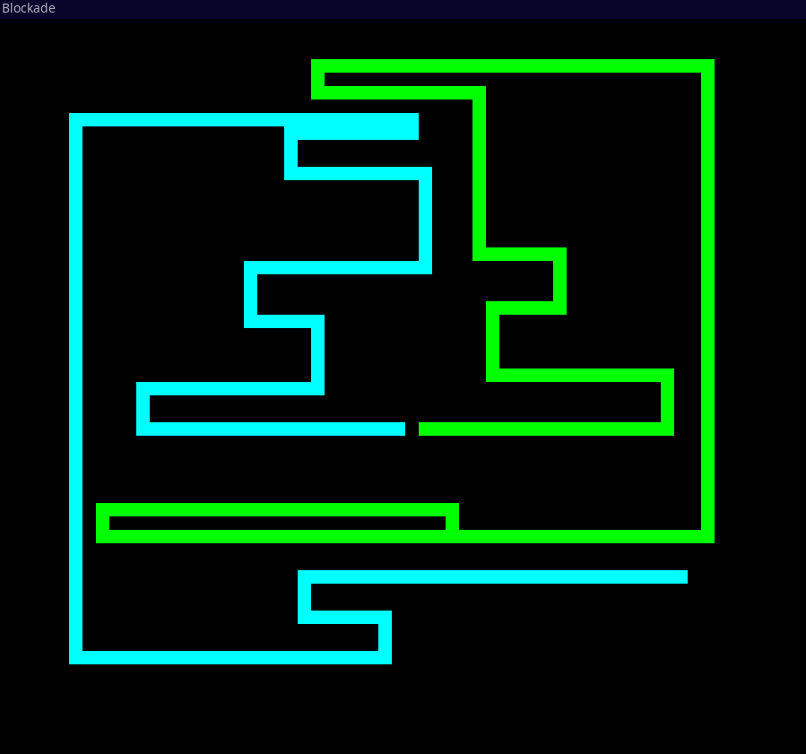

## What is Blockade? 

"Blockade" is a vintage arcade game that emerged in the early 1970s, marking a significant milestone in the history of video gaming. Designed by Steve Russell, the game features two players maneuvering their snake-like vehicles across a black-and-white screen. The objective is to avoid collisions with walls, obstacles, and the growing trails left behind by the players' snakes. 

## Controls and Aim

There are two players: blue and green. The goal is to survive longer than your opponent without running into any obstacles. The controls are:

- `Green`: Arrow Keys
- `Blue`: WASD

Meanwhile, the size of the snakes will continuously grow. Careful strategy is key. 

